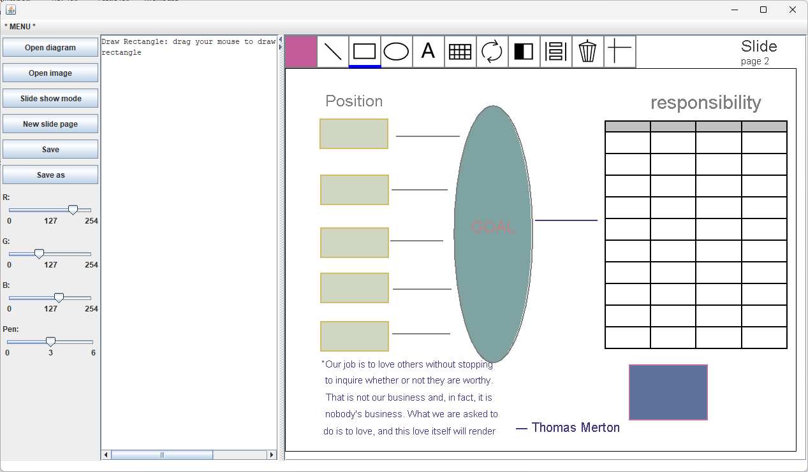

# Diagram Editor 
## Introduction:
After a month of learning Java, we were tasked with creating a diagram editor capable of editing basic shapes and PPM images within four days using the knowledge we had acquired.

Please check the YouTube video to see the functionalities I implemented:  
[**Video Demonstration**](https://youtu.be/L-HQ-lrKjQo)  

The graphical interface development was facilitated using the basic instructional library provided by the school, known as ecs100.jar. This library offers a canvas for drawing graphics, images, and text strings. Additionally, it provides functionality for responding to mouse events. Leveraging these features, I manually implemented a range of underlying GUI functionalities including element layout, button clicks, screen refresh and more.

Find the executable application (diagram.exe) from Google Drive:  
[**Edmond's Java Program Collection.zip (Windows)**](https://drive.google.com/drive/folders/1ovLlyHeENMtQDsT5b9hJBcHwKPCrC6Mg?usp=sharing)  

## Snapshot
 

## Features
- Graphic creation and editing
- Invert, move, rotate, format, delete
- Customizable colors
- Built-in buttons on the canvas
- Support for border color and fill color
- Objects follow the mouse when moved
- Objects are confined to the canvas when moved
- Support for Z-axis stacking
- Import and edit PPM files
- Diagram saving and loading
- Browse in slide mode
- Create and edit slides

## Knowledge & Skills
- abstract class and inherit
- object and field method override
- file I/O
- underlying logic of GUI programs
- modifying image files at the pixel level using loops and arrays.

## Run Instruction
### Requirement:
- Java Runtime Environment

### Steps:   
To run the source code in development environment, please follow the steps below:
1. Clone the repository from the GitHub
2. Add ecs100.jar to Build Path
3. Run the *Diagram_Main.java* in the default package.

## License
MIT